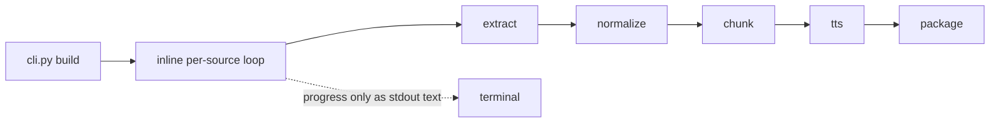
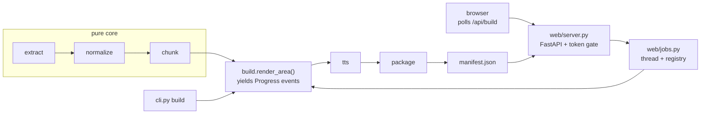

# milisten

Turn articles, papers and regulatory PDFs into chaptered audiobooks you can listen to.

Text-to-speech is a solved problem. Reading *legal and regulatory* prose aloud is not.
Every reader app on the market renders `90 Fed. Reg. 898 (6 Jan. 2025)` as
"ninety fed reg eight ninety eight six jan two thousand twenty five", and reads URLs
character by character. milisten fixes the text before the voice ever sees it.

## What changes

Before — an off-the-shelf reader app speaks the raw string:

<details>
<summary>Before</summary>

```
source ──▶ text extraction ──▶ TTS ──▶ audio
```

```
in:   "SEC, Release Nos. 33-11414, 91 Fed. Reg. 24968 (7 May 2026), 91pp.
       See https://sec.gov/rules"
out:  "sek release nos thirty-three dash eleven four fourteen ninety-one fed reg
       twenty-four thousand nine hundred sixty-eight seven may twenty twenty-six
       ninety-one pee pee see aitch tee tee pee ess colon slash slash ess ee see
       dot gee oh vee slash rules"
```

</details>

After — a normalization stage sits between extraction and synthesis:

```
source ──▶ extract ──▶ normalize ──▶ chunk ──▶ TTS ──▶ m4b + chapters
             │            │            │        │
          html/pdf    citations    sentence   Kokoro
          reading     acronyms     boundary   (local)
           order      numbers
```

```
in:   "SEC, Release Nos. 33-11414, 91 Fed. Reg. 24968 (7 May 2026), 91pp.
       See https://sec.gov/rules"
out:  "S E C, Release Number 33 dash 11414, volume 91 of the Federal Register at
       page 24968 (7 May 2026), 91 pages. See"
```

## Install

```bash
git clone <this repo> && cd milisten
brew install poppler espeak-ng ffmpeg   # pdftotext, phonemizer, muxer
uv sync
```

The first `build` downloads Kokoro-82M (~330 MB) once. Everything after that is offline.

## Use

```bash
milisten add https://example.com/article --area ai-governance
milisten add ~/Downloads/aba-deal-points-2025.pdf -t "ABA Deal Points Study" -a ma
milisten import reading-list.txt        # bulk queue: "area | title | ref" lines
milisten list

milisten preview                        # print normalized text — tune rules here first
milisten build --area ai-governance     # one .m4b per area, one chapter per source
```

Output lands in `~/.milisten/audio/<area>.m4b`. AirDrop it, or drop it in Apple
Books / Plex / any podcast app — chapter marks and resume position work.

## Web UI

```bash
milisten ui            # foreground, opens a browser
milisten ui start      # detached; survives the shell exiting
milisten ui stop
milisten ui open       # reopen the running instance
```

Manage the queue, preview normalized text, launch a render and watch it progress,
then play the result with chapter navigation — all in one page. Binds `127.0.0.1`
only, mints a per-session token, and makes zero external network requests.

<details>
<summary>Before — the CLI owned the render loop</summary>



</details>

<details open>
<summary>After — one build path, two front ends</summary>



`render_area` is a generator yielding one `Progress` event per step, so the CLI
prints and the browser polls without either owning the sequencing.

</details>

Each rendered `.m4b` gets a sibling `<area>.json` recording the same chapter
spans, because browsers cannot read MP4 chapter marks. Recordings made before
manifests existed are backfilled from `ffprobe` on first view.

| Flag | Why you'd reach for it |
|---|---|
| `--engine say` | Skip the model download; prove the pipeline works with macOS voices |
| `--voice michael` | `heart`, `bella`, `nicole`, `michael`, `fenrir`, `emma`, `george` |
| `--speed 1.15` | Bakes the rate into synthesis instead of relying on the player |
| `--layout` | Two-column PDFs whose reading order comes out interleaved |
| `--keep-wav` | Inspect or re-cut individual chapters |

## Paywalled sources

`milisten` will not get past a paywall, and says so instead of rendering a
subscription prompt into audio. For the ABA Deal Points Study and anything similar:
download it by hand, then `milisten add <path>`. Local files take the same route
through the pipeline as URLs.

## Design

Pure core, imperative shell. `normalize`, `chunk` and `package` are pure functions
over strings and frozen dataclasses, so the interesting logic is tested without
mocks or network. Every side effect — HTTP, `pdftotext`, model inference, `ffmpeg` —
is confined to `extract`, `tts` and `cli`.

| Module | Role |
|---|---|
| `models.py` | Frozen `Source`, `Document`, `Chunk`, `Chapter` |
| `extract.py` | HTTP, trafilatura, `pdftotext` — the only readers |
| `normalize.py` | **Pure.** Citation, acronym and number rewriting |
| `chunk.py` | **Pure.** Sentence-boundary packing to speech-sized pieces |
| `manifest.py` | **Pure** chapter spans, plus one read and one write |
| `tts.py` | Kokoro (local) or macOS `say`, behind one `Synthesizer` protocol |
| `package.py` | **Pure** ffmetadata generation; one `ffmpeg` call to mux |
| `build.py` | The one render path, as a generator of `Progress` events |
| `library.py` | Queue persistence in `~/.milisten/queue.json` |
| `cli.py` | Imperative shell |
| `web/ranges.py` | **Pure** HTTP Range parsing — seeking a 10-hour file needs it |
| `web/security.py` | Loopback Host/Origin gate plus per-session token |
| `web/jobs.py` | One render at a time, on a daemon thread, polled over HTTP |
| `web/server.py` | FastAPI routes; blocking work stays in sync handlers |
| `web/launcher.py` | Free port, minted token, browser open, detached daemon |
| `web/static/` | Vanilla JS, no build step, no external requests |

## Adding normalization rules

`normalize.py` holds ordered rule tables. Composite citations are expanded before
their component abbreviations, so order matters — append to the right table, not the end.

```bash
uv run pytest test/unit/test_normalize.py -q   # add a case first, then the rule
uv run milisten preview <ref>                  # see it on the real document
```

Two properties the suite enforces and any new rule must keep: `normalize` is
**idempotent** (running it twice changes nothing), and no rule may leave a URL in
the output.

## License

MIT.
